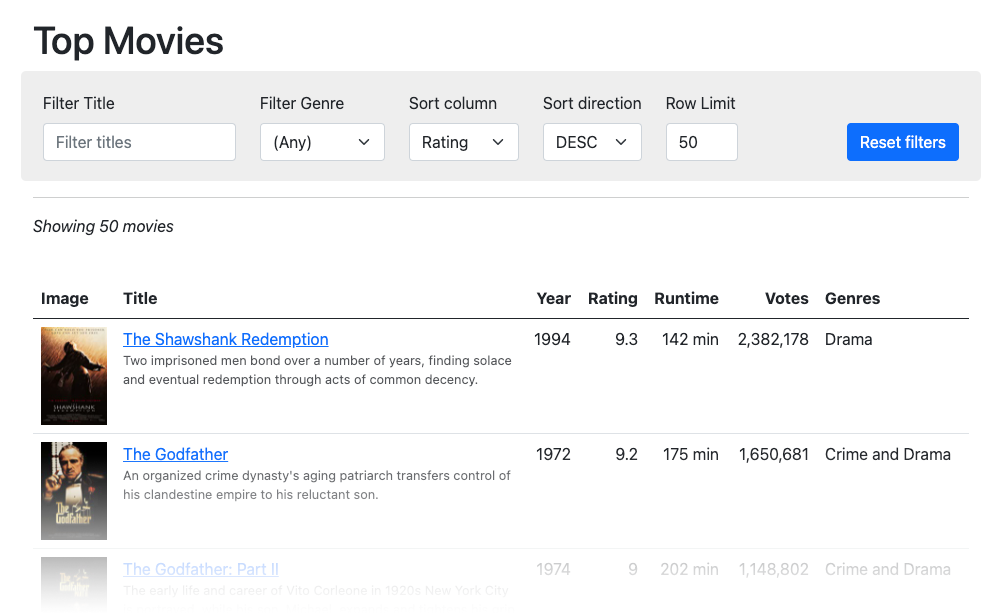
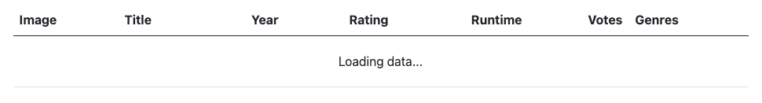
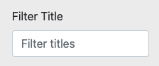
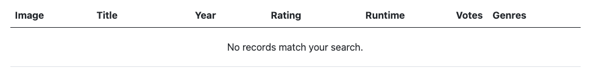
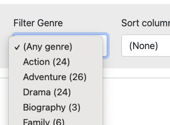
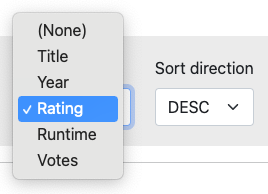
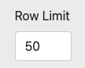
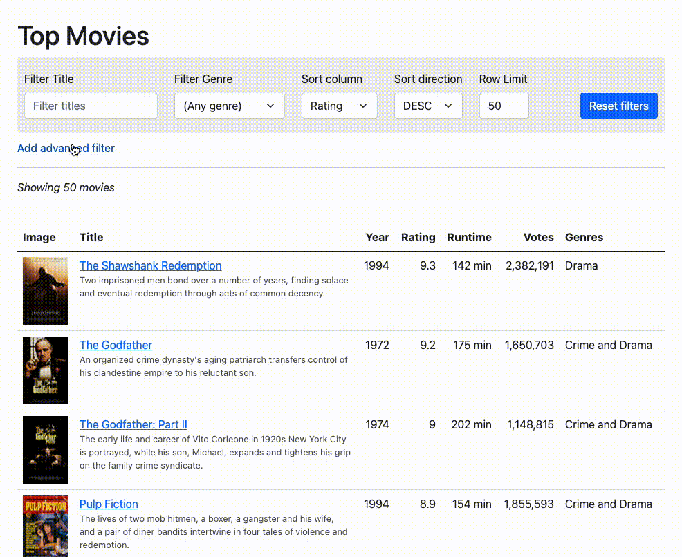

# Front-End Challenge

The goal is to implement a simple web app that lists top-rated movies in a table and allows the user to filter and sort the results.

[Click here to see an example.](http://fp-public-tests.s3-website-us-east-1.amazonaws.com/hr/frontend-challenge/)

## Instructions

- Try to implement the **features** described below, preferably using a modern frontend framework such as Vue.js or React.

    **Vue.js** would be preferable since this is what we use at Fanplayr, however you are free to use whatever makes you most productive.

- Aim for a **similar layout** as in the example.

    You may use pure CSS frameworks such as Bootstrap or Tailwind for styling. (We used Bootstrap in the example).

- **Avoid** using component/UI frameworks to handle the display, filtering and sorting the data in the table. The goal is to implement this yourself.

## Features

### 1. Fetch data

Fetch the movie data dynamically from: <https://6049e293fb5dcc001796aba6.mockapi.io/movies>

### 2. Display data in a table

Display the movies in a `<table>` element with all the columns shown in the example:

  - Image
  - Title
    - The title should be a link that opens the IMDB page in a new browser tab.
    - The movie description should appear below the title in a smaller font.
  - Year
  - Rating
  - Runtime
  - Votes
  - Genres

### 3. Loading message

Show a loading message such as the following while the data is being fetched:

### 4. Filter by Title

Add an `<input>` element which allows the user to filter the results based on the "title" column.

### 5. No results message

Show a message to the user when they use filters which return no results:

### 6. Filter by Genre

Add a `<select>` element which allows the user to filter based movie genre.

- The first option should skip filtering by genre, e.g. "(Any genre)".

- The action list of genre options should:

    1. Be dynamically generated based on the movie data.

    2. Be sorted alphabetically.

    3. Include the number of movies in the genre in parentheses.

For example, the first few options in the `<select>` should include:

- (Any genre)
- Action (24)
- Adventure (26)
- Drama (24)

### 7. Sorting

- Add one `<select>` element which allows the user to sort by the following columns:

    - (None) - No sorting
    - Title
    - Year
    - Rating
    - Runtime
    - Votes

- Add a second `<select>` element which allows the user to choose the direction to sort the results:

    - Ascending
    - Descending

- By default, sort by "Rating" in the "Descending" order.

### 8. Limiting results

Add an `<input>` element which allows the user to limit the maximum number of results shown.

### 9. Reset button

Add a button to reset all the options.

### 10. Save preferences

Store the filter preferences in the browser so that when the page is refreshed it returns to the same state after the movie data is loaded.

## Bonus

Discuss how you would implement the "Advanced Filter" feature in the demo:

